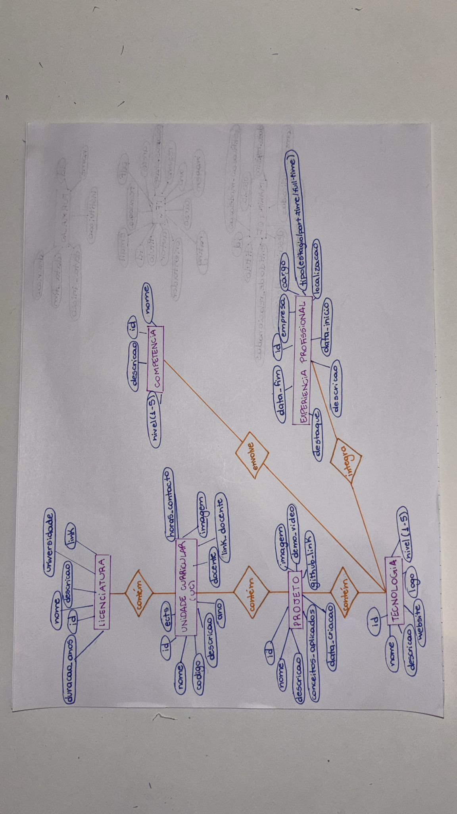
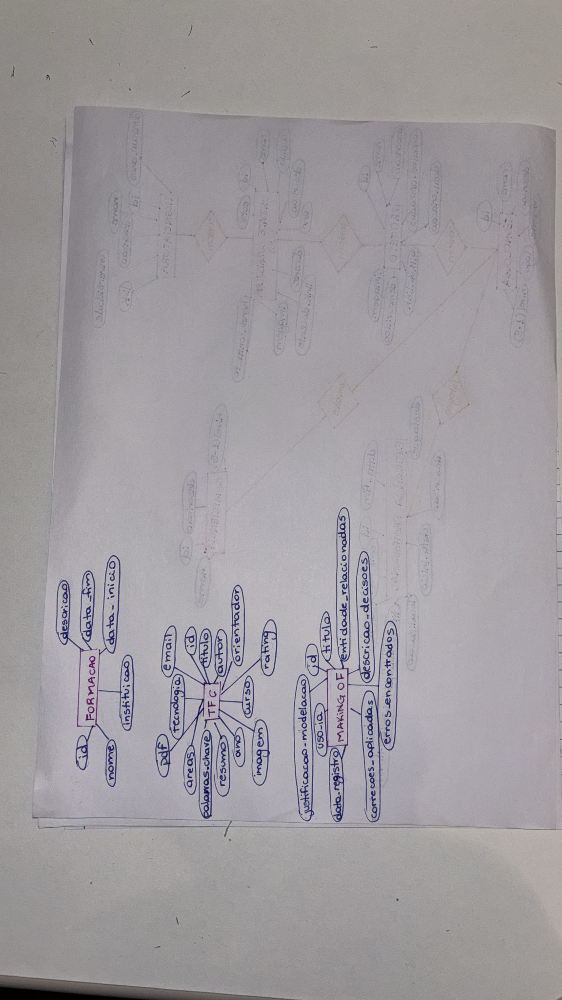
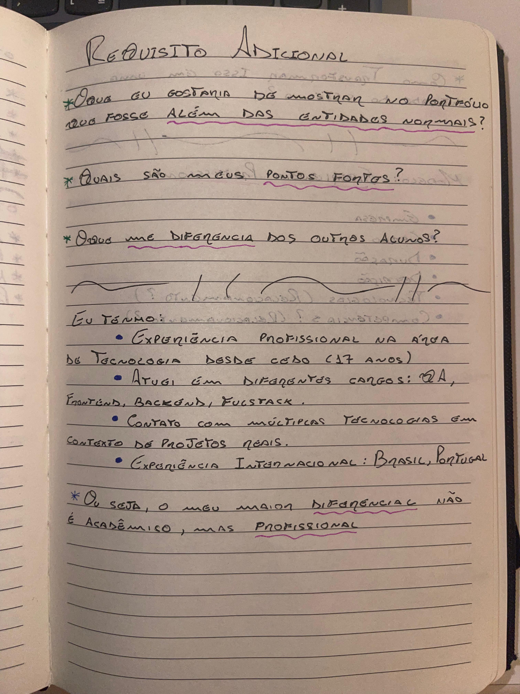
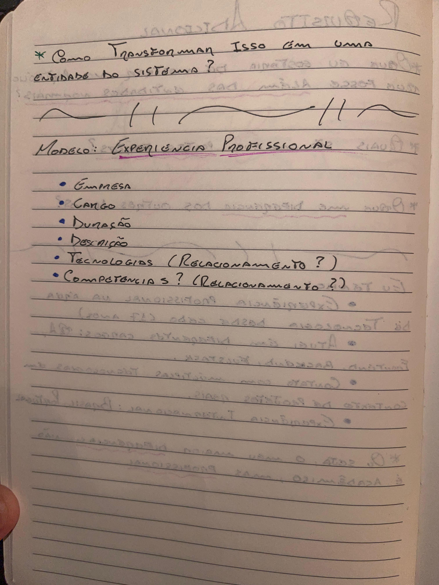
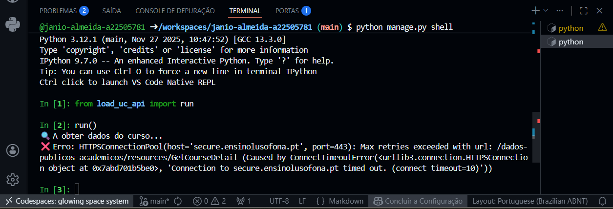
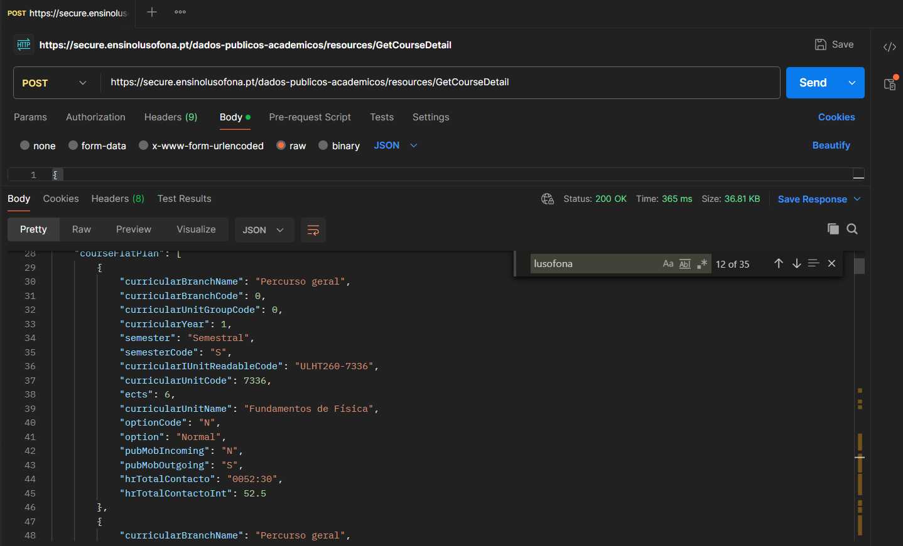
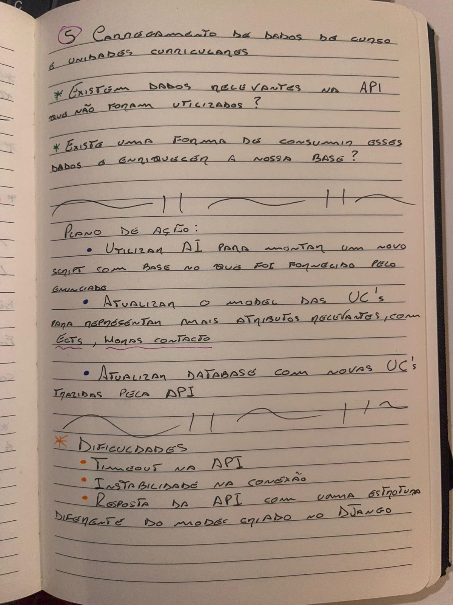

# 📘 Making Of - Projeto Django Portfolio

Este documento descreve o processo de modelação e desenvolvimento da aplicação de portfólio académico e profissional, incluindo decisões, evolução do modelo, erros encontrados e integrações externas.

As evidências visuais (DERs, esquemas e anotações em papel) encontram-se na pasta: media/makingof

---

# 🧠 Processo de Modelação (DER)

## ❓ Porque é que estas entidades foram escolhidas?

O sistema foi pensado para representar três dimensões principais:

- Percurso académico
- Percurso profissional
- Conhecimento técnico

## ❓ O que eu queria representar?

Queria construir um portfólio que não fosse apenas estático, mas que mostrasse:

- evolução académica (UCs, projetos, licenciatura)
- experiência profissional real
- competências técnicas associadas a tecnologias reais

---

## 📷 Evidência

---

# 🔧 2. Requisito Adicional

## ❓ O que foi adicionado?

Foi introduzida a entidade:

👉 **ExperienciaProfissional**

## ❓ Porque foi escolhida esta entidade?

Porque o objetivo do projeto não é apenas académico, mas também demonstrar:

- experiência real no mercado
- evolução profissional
- diversidade de papéis técnicos

## ❓ O que eu queria alcançar?

- Diferenciar o portfólio de um aluno comum
- Mostrar experiência internacional e prática
- Representar evolução de QA → Fullstack → Consultoria

## ❓ Como isso melhora o projeto?

- adiciona credibilidade profissional
- conecta tecnologias reais a experiências reais
- reforça o storytelling do portfólio

---

## 📷 Evidência

---

# 🌐 Integração com API de Cursos e UCs (Lusófona)

## ❓ O que foi feito?

Foi utilizado um script Python para consumir a API da Universidade Lusófona:

- Cursos
- Unidades Curriculares

## ❓ Problema encontrado

Inicialmente ocorreram erros de timeout ao consumir a API diretamente no ambiente de desenvolvimento.

## ❓ Como foi resolvido?

- Teste da API via Postman
- Alteração da estratégia para importação via JSON
- Ajuste do script para uso local com ORM Django

---

## 📷 Evidência

---

# 🤖 Uso de Inteligência Artificial

Durante o desenvolvimento foi utilizada IA para:

- apoio na modelação do DER
- validação de relações entre entidades
- estruturação do script de importação para as UC´s
- Auxilio na criação do arquivo .md de making of

---